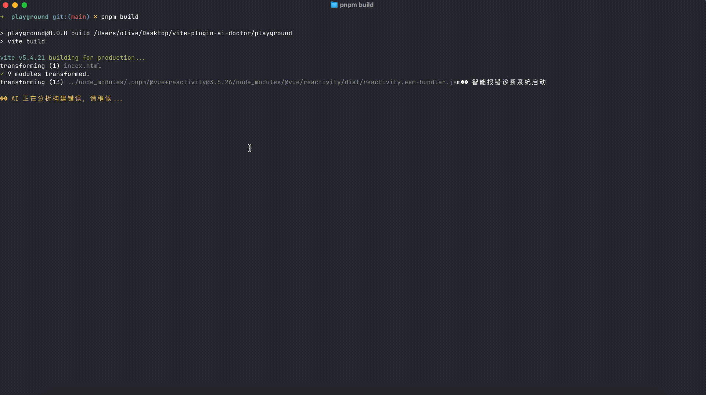

# vite-plugin-ai-doctor

🚨 AI 驱动的 Vite 构建错误诊断插件



## 功能特性

- 🤖 构建失败时自动调用 AI 进行错误诊断
- 💬 打字机效果输出，提升用户体验
- 🎨 ANSI 颜色支持，输出更美观
- 🛡️ 完善的异常处理，不影响构建流程

## 安装

```bash
pnpm add -D vite-plugin-ai-doctor
```

## 安装模型依赖

根据你使用的模型提供商，安装对应的依赖：

### 智谱AI (ZhipuAI)

**无需额外安装依赖！** 插件直接通过 HTTP API 调用智谱AI，无需安装任何额外的包。

只需要：
1. 在 [智谱开放平台](https://open.bigmodel.cn/) 注册账号
2. 获取 API Key
3. 在插件配置中传入 API Key 即可

### OpenAI

```bash
pnpm add @langchain/openai
```

### Ollama (本地模型)

```bash
pnpm add @langchain/ollama
```

## 使用方法

在 `vite.config.ts` 中引入插件并配置模型：

### 使用智谱AI（推荐）

智谱AI无需安装额外依赖，直接通过 HTTP API 调用，使用最简单：

```ts
import { defineConfig } from 'vite'
import vitePluginAiDoctor from 'vite-plugin-ai-doctor'

export default defineConfig({
  plugins: [
    vitePluginAiDoctor({
      model: {
        provider: 'zhipuai',
        apiKey: process.env.ZHIPUAI_API_KEY!, // 从环境变量读取，必填
        model: 'glm-4', // 可选，支持 'glm-4', 'glm-4.7', 'glm-4.6v' 等，默认 'glm-4'
        baseURL: 'https://open.bigmodel.cn/api/paas/v4', // 可选，默认值
        temperature: 0.7, // 可选，控制输出随机性，默认 0.7
      },
      typeWriterSpeed: 20,
    }),
  ],
})
```

**获取智谱AI API Key：**
1. 访问 [智谱开放平台](https://open.bigmodel.cn/)
2. 注册/登录账号
3. 在个人中心创建 API Key
4. 将 API Key 设置为环境变量：`export ZHIPUAI_API_KEY=your-api-key`

### 使用 OpenAI

```ts
import { defineConfig } from 'vite'
import vitePluginAiDoctor from 'vite-plugin-ai-doctor'

export default defineConfig({
  plugins: [
    vitePluginAiDoctor({
      model: {
        provider: 'openai',
        apiKey: process.env.OPENAI_API_KEY!, // 从环境变量读取
        model: 'gpt-4', // 可选，默认 'gpt-4'
        temperature: 0.7, // 可选
      },
    }),
  ],
})
```

### 使用 Ollama (本地模型)

```ts
import { defineConfig } from 'vite'
import vitePluginAiDoctor from 'vite-plugin-ai-doctor'

export default defineConfig({
  plugins: [
    vitePluginAiDoctor({
      model: {
        provider: 'ollama',
        model: 'llama3', // 必需
        baseURL: 'http://localhost:11434', // 可选，默认 'http://localhost:11434'
        temperature: 0.7, // 可选
      },
    }),
  ],
})
```

### 使用自定义模型实例

如果你已经有 LangChain 模型实例，可以直接传入：

```ts
import { defineConfig } from 'vite'
import vitePluginAiDoctor from 'vite-plugin-ai-doctor'
import { ChatOpenAI } from '@langchain/openai'

const customModel = new ChatOpenAI({
  openAIApiKey: 'your-key',
  modelName: 'gpt-4',
})

export default defineConfig({
  plugins: [
    vitePluginAiDoctor({
      model: {
        provider: 'custom',
        model: customModel,
      },
    }),
  ],
})
```

### 选项说明

- `model` (必需): 模型配置对象
  - `provider`: 模型提供商，支持 `'zhipuai'` | `'openai'` | `'ollama'` | `'custom'`
  - 智谱AI: `apiKey` (必需), `model` (可选), `baseURL` (可选), `temperature` (可选)
  - OpenAI: `apiKey` (必需), `model` (可选), `baseURL` (可选), `temperature` (可选)
  - Ollama: `model` (必需), `baseURL` (可选), `temperature` (可选)
  - Custom: `model` (必需，LangChain 模型实例)
- `enabled`: 是否启用插件，默认 `true`
- `typeWriterSpeed`: 打字机效果每个字符的延迟时间（毫秒），默认 `20`
- `showOriginalError`: 当 AI 调用失败时，是否显示原始错误信息，默认 `true`

## 工作原理

1. **触发时机**：使用 `buildEnd(error)` Hook，仅在构建失败时执行
2. **错误捕获**：收集错误信息（message、stack、id）
3. **AI 诊断**：根据配置的模型提供商，动态加载对应的 LangChain 包并调用模型进行错误分析
4. **结果输出**：以打字机效果输出诊断建议

## 环境变量

建议使用环境变量来存储 API Key，避免将敏感信息提交到代码仓库：

```bash
# .env
ZHIPUAI_API_KEY=your-api-key-here
OPENAI_API_KEY=your-api-key-here
```

然后在 `vite.config.ts` 中使用：

```ts
model: {
  provider: 'zhipuai',
  apiKey: process.env.ZHIPUAI_API_KEY!,
}
```

## 技术细节

### 为什么使用 `buildEnd` 而不是 `transform`？

- `buildEnd` 在构建流程的最后执行，可以捕获所有构建阶段的错误
- `transform` 只在模块转换时触发，无法捕获构建配置、依赖解析等阶段的错误
- `buildEnd` 的 `error` 参数包含了完整的构建错误信息

### 为什么使用 `process.stdout.write`？

- `console.log` 会自动添加换行符，无法精确控制输出
- `process.stdout.write` 可以逐字符输出，实现打字机效果
- 可以保留 ANSI 颜色代码，让输出更美观

### 为什么 `enforce: "post"`？

- 确保在其他插件处理完后再执行，避免干扰构建流程
- 作为后置插件，可以获取到完整的构建结果和错误信息
- 即使构建失败，也能正常执行诊断逻辑

### 为什么 AI 调用要 try/catch 包住？

- 本地模型可能未启动（如 Ollama 未运行）
- 网络问题或模型服务异常
- 避免 AI 调用失败导致插件崩溃，影响构建流程
- 提供友好的错误提示，引导用户检查模型配置

## 示例输出

```
🚨 智能报错诊断系统启动

🤖 AI 正在分析构建错误，请稍候...

━━━━━━━━━━━━━━━━━━━━━━━━━━━━━━━━━━━━━━━━
💡 AI 诊断建议：
━━━━━━━━━━━━━━━━━━━━━━━━━━━━━━━━━━━━━━━━

根据错误信息，这是一个模块解析问题...

━━━━━━━━━━━━━━━━━━━━━━━━━━━━━━━━━━━━━━━━
诊断完成，请根据上述建议修复错误。
```

## 测试 Playground

项目包含一个 playground 目录，用于测试插件功能：

```bash
cd playground
pnpm install
pnpm build  # 正常构建测试
```

要测试错误诊断功能，可以：

1. 编辑 `playground/src/test-error.ts`，取消注释错误代码
2. 在 `playground/src/main.ts` 中导入该文件
3. 运行 `pnpm build` 触发构建错误
4. 观察插件自动调用 AI 进行诊断

详细说明请查看 [playground/README.md](./playground/README.md)

## License

MIT

